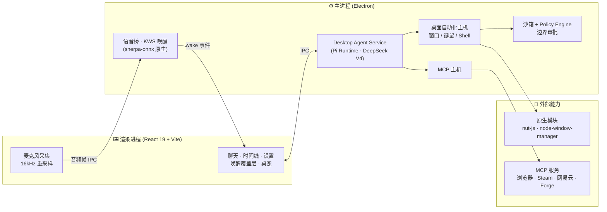

<div align="center">

# 🐧 Pi 桌面助手 · Desktop Assistant

**一个 Windows 优先、本地优先的 AI 桌面助手——会说话、能操作电脑、可自我进化。**

基于 [Pi Agent Runtime](https://github.com/earendil-works/pi) 构建，默认接入 DeepSeek V4，全程离线唤醒，桌面动作可沙箱审批。

<br/>

[](LICENSE)
[](#-环境要求)
[](#-环境要求)
[](#-技术栈)
[](#-技术栈)
[](#-配置)

<br/>

[快速开始](#-快速开始) · [核心能力](#-核心能力) · [架构](#-架构) · [语音唤醒](#-语音唤醒) · [桌面工具](#-桌面自动化工具) · [MCP 插件](#-mcp-插件) · [文档](#-文档)

</div>

---

## ✨ 它是什么

桌面助手是一个跑在你 Windows 电脑上的 AI 客户端：用一句「小派」唤醒它，然后用自然语言让它**打开应用、操控窗口、写 Word / Excel / PPT、控制音乐与游戏、在浏览器里替你点点点**。所有语音唤醒在本机完成、不出网；每一个会改动真实系统的动作都先经过沙箱与审批边界。

它不是一个云端套壳——而是把 Pi 的 Agent 运行时搬到桌面，外接一整套**本机自动化工具 + 可热插拔的 MCP 插件 + 可自我进化的工具锻造框架**。

> 🔑 仓库**不含任何 API Key**。在应用设置里填入 DeepSeek Key，或设置环境变量 `DEEPSEEK_API_KEY` 即可。

---

## 🚀 核心能力

| | 能力 | 说明 |
|---|---|---|
| 🎙️ | **离线语音唤醒** | sherpa-onnx KWS 关键词检测，默认唤醒词「小派」，全离线、无需训练；中文唤醒词改一行字即可，自动转拼音 token |
| 🗣️ | **说话即下令 / 运行中打断** | 唤醒 → 说话 → 执行；模型回答途中再喊一声唤醒词即可**立即打断**当前会话 |
| 🖱️ | **桌面自动化** | 找/开应用、窗口与多媒体控制、键鼠合成、屏幕观察与截图、安全 Shell 执行 |
| 📄 | **Office 文档操作** | 创建/读取/编辑 Word、Excel、PPT；内置 COM + 可选文件型 MCP，能力门控 + 技能路由 |
| 🛡️ | **沙箱 + 边界审批** | 真沙箱工作区 + `policy-engine` 唯一裁决，四种模式重定义，真实动作需审批 |
| 🔌 | **MCP 插件体系** | 全局开关 + 本地 stdio 服务管理；内置浏览器、Steam、网易云、Forge 四个示例 |
| 🧬 | **Forge 自演化工具** | AI 在目标应用里逆向、试验，把新能力以数据持久化为新工具，可跨机器分享 |
| 🌐 | **浏览器接管** | 控制 Chrome/Edge：接管标签页（不碰活跃页）+ 页面内虚拟鼠标（CDP 合成，不动真鼠标） |
| 🐱 | **桌宠** | 像素猫 / 狐狸桌宠，canvas overlay + 物理 + 情绪状态机，`/cat` 召唤 |
| 🧩 | **多会话并行** | Map 编排 + 焦点切换 + 桌面动作互斥 + 状态点/通知 + LRU 驱逐 |
| 💾 | **本地记忆与归档** | 对话归档、自动标题、记忆库；Token 节省的冻结式上下文压缩 |

---

## 🏗️ 架构



**要点**：语音推理跑在主进程的原生代码里，音频只在本机进程间流转；所有改动真实系统的桌面动作先过 `policy-engine` 与沙箱边界；MCP 工具在普通桌面工具之前暴露，可全局一键开关。

---

## ⚡ 快速开始

```powershell
# 1) 克隆
git clone https://github.com/Passer1072/Desktop_Assistant.git
cd Desktop_Assistant

# 2) 一次性准备（装依赖 + 拉 Electron 运行时 + 构建）
python .\start_desktop_assistant.py --prepare-only

# 3) 启动
python .\start_desktop_assistant.py --skip-install --skip-build
```

首次启动后，进入 **设置 → 填入 DeepSeek API Key**，再喊一声「**小派**」即可开始。

> 想拥有离线唤醒，请先下载 KWS 模型（约 13MB，仅一次）：
> ```powershell
> npm --workspace @earendil-works/pi-desktop-assistant run fetch:kws
> ```

---

## 📋 环境要求

| 工具 | 版本 | 用途 |
|---|---|---|
| **Windows** | 10 / 11 | 目标平台 |
| **Node.js** | `>= 22.19.0` | 运行时 & 构建（含 npm） |
| **Python** | `3.10+` | 启动器 `start_desktop_assistant.py` |
| **Git** | 任意近期版本 | 克隆仓库 |

校验：

```powershell
git --version; node --version; npm --version; python --version
```

---

## 🛠️ 安装与运行

`start_desktop_assistant.py` 是唯一入口，按需调用 npm 与构建脚本。

<details>
<summary><b>启动器参数一览</b>（点击展开）</summary>

| 参数 | 作用 |
|---|---|
| `--prepare-only` | 装依赖 + 拉 Electron + 构建后退出，不启动 |
| `--skip-install` | 跳过 `npm install` |
| `--skip-build` | 跳过构建（要求已有产物） |
| `--rebuild` | 强制全量重新构建 |
| `--dev-renderer` | 启动 Vite 渲染端开发服务器并让 Electron 指向它 |

</details>

**首次准备**（推荐）：

```powershell
python .\start_desktop_assistant.py --prepare-only
```

该命令会：① 以 `--ignore-scripts --legacy-peer-deps` 安装依赖 → ② 确保 Electron 运行时二进制就绪 → ③ 构建桌面助手所需的各包。

**日常运行**：

```powershell
# 已准备好：直接起
python .\start_desktop_assistant.py --skip-install --skip-build

# 或让它自动判断（缺依赖会装、源码比产物新会重建）
python .\start_desktop_assistant.py
```

**开发模式**（热重载渲染端）：

```powershell
python .\start_desktop_assistant.py --dev-renderer
# 自动设置 DESKTOP_ASSISTANT_DEV_SERVER_URL=http://127.0.0.1:5178
```

---

## 🔑 配置

API Key **不入库**。两种填入方式：

```powershell
# 方式一：应用内「设置」界面填入 DeepSeek Key（推荐）

# 方式二：当前 PowerShell 会话临时设置
$env:DEEPSEEK_API_KEY = "your-key"
python .\start_desktop_assistant.py --skip-install --skip-build
```

默认模型：**DeepSeek V4**（`deepseek-v4-pro`，快速模式 `deepseek-v4-flash`），走 Pi 模型注册表。

以下本地运行数据均在版本控制之外：`auth.json`、`save/`、`data/`、`bc_*.db`、`dist/`、`renderer-dist/`、`node_modules/`。

---

## 🎙️ 语音唤醒

默认引擎为 **sherpa-onnx KWS**——原生、全离线、无需训练，换唤醒词只改一行文本。

```text
引擎优先级： KWS (sherpa-onnx · 默认)  →  openWakeWord (需自训练)  →  Vosk  →  浏览器识别

运行链路：   麦克风(渲染) → 重采样 16kHz → IPC 流式帧 → 主进程 KWS → 命中 → wake 事件 → 等待说话
```

- **自定义唤醒词**：设置页直接填任意中文（如「贾维斯」），自动转带调拼音 token 并对照模型词表校验。
- **灵敏度**：`kwsSensitivity`（0–1，默认 0.6），内部映射为关键词阈值；误唤醒多就调低，唤不醒就调高。
- **运行中打断**：唤醒监听持续运行（仅录音几秒暂停），模型回答途中再喊唤醒词会立即打断当前会话。

> 模型文件缺失时自动回退到 Vosk/浏览器识别，并在唤醒覆盖层提示运行 `npm run fetch:kws`。
> 详见 → [`docs/wake-word.md`](packages/desktop-assistant/docs/wake-word.md)

---

## 🖱️ 桌面自动化工具

模型可调用的本机工具（节选）：

| 分类 | 工具 |
|---|---|
| **应用 & 系统** | `find_app` · `open_app` · `open_windows_settings` · `set_audio_device_or_volume` · `set_display_brightness_or_scale` |
| **窗口 & 输入** | `window_control` · `keyboard_mouse` · `media_control` · `app_interaction` |
| **感知** | `desktop_observe` · `get_screen_context` |
| **Shell（安全）** | `shell_command_safe` · `shell_command_continue` · `shell_command_abort` |
| **文档** | `doc_create_from_html` · `doc_read` · `doc_inspect` · `doc_plan_edits` · `doc_apply_edits` · `doc_verify` · `office_word_run` |
| **表格 & 演示** | `excel_read` · `excel_write` · `office_excel_run` · `ppt_create` · `ppt_read` · `office_ppt_run` |
| **沙箱** | `sandbox_status` · `sandbox_init` · `sandbox_reset` · `sandbox_list` · `sandbox_clean` · `sandbox_import` · `sandbox_export` |

技能（`skills/`）为模型提供路由说明：`system-operation` · `document-operation` · `excel-operation` · `ppt-operation` · `voice-input`。

---

## 🔌 MCP 插件

> 打开 **设置 → MCP Manager**。MCP 启用时，已启用的服务会被启动，其工具排在普通桌面工具之前；禁用时不暴露任何 MCP 工具并关闭 stdio 服务。

**内置示例**（`packages/desktop-assistant/mcp-servers/`）：

| 插件 | 能力 | 原理 |
|---|---|---|
| 🌐 **browser-control** | 控制 Chrome/Edge | 接管标签页 + 页面内虚拟鼠标（CDP 合成，不动真鼠标） |
| 🎮 **steam** | 控制 Steam | `steam://` 协议 + 本地 VDF 清单，不注入、不改安装目录 |
| 🎵 **netease-music** | 控制网易云 3.x | CDP 调试端口，零注入、不改文件、不触发启动保护 |
| 🧬 **forge** | 自演化 MCP 框架 | AI 逆向并把新能力持久化为新工具，App 无关、可分享 |

最小外部 stdio 配置：

```json
{
  "name": "Chrome Controller",
  "enabled": true,
  "transport": "stdio",
  "command": "node",
  "args": ["C:/tools/chrome-mcp/server.js"],
  "toolNamePrefix": "chrome",
  "timeoutMs": 10000
}
```

---

## 🧰 常用命令

```powershell
npm run check     # 格式化 + lint + 锁版本检查 + TS 检查 + shrinkwrap + 浏览器冒烟
npm run build     # 构建所有 workspace 包

# 仅桌面助手包
npm --workspace @earendil-works/pi-desktop-assistant run build
npm --workspace @earendil-works/pi-desktop-assistant run test
```

---

## 📁 项目结构

```text
Desktop_Assistant/
├─ start_desktop_assistant.py        # 启动器（装依赖/构建/启动）
├─ packages/
│  ├─ desktop-assistant/             # ⭐ 桌面助手主包
│  │  ├─ src/main/                   #   Electron 主进程 · IPC · 预加载
│  │  ├─ src/agent/                  #   Agent 服务 · 记忆 · 归档 · Token 压缩
│  │  ├─ src/voice/                  #   KWS 唤醒 · STT · 语音桥
│  │  ├─ src/desktop/                #   自动化主机 · 沙箱 · 风险/调度
│  │  ├─ renderer/src/               #   React 渲染端（chat/settings/pet/voice）
│  │  ├─ mcp-servers/                #   内置 MCP：browser/steam/netease/forge
│  │  ├─ skills/                     #   模型技能路由（SKILL.md）
│  │  ├─ resources/kws/              #   离线唤醒模型（fetch:kws 拉取，不入库）
│  │  └─ docs/                       #   MCP / 唤醒词等文档
│  └─ agent · ai · coding-agent · tui   # Pi 运行时共享包
└─ scripts/                          # 仓库级检查脚本
```

---

## 🩺 故障排查

| 现象 | 解决 |
|---|---|
| Electron 二进制缺失 | `npm exec --package electron@42.3.0 -- install-electron` |
| `python` 找不到 | 改用 `py .\start_desktop_assistant.py --prepare-only` |
| 原生依赖安装失败 | 先确认 `node --version` ≥ `22.19.0` |
| 干净克隆构建不过 | `npm run check` 后 `python .\start_desktop_assistant.py --rebuild --prepare-only` |
| 唤不醒 / 误唤醒多 | 设置页调 `kwsSensitivity`；模型缺失则 `npm run fetch:kws` |

---

## 📚 文档

- [桌面助手包 README](packages/desktop-assistant/README.md)
- [MCP 管理](packages/desktop-assistant/docs/mcp.md)
- [编写 MCP 服务](packages/desktop-assistant/docs/mcp-server-authoring.md)
- [内置桌面助手 MCP](packages/desktop-assistant/docs/mcp-desktop-assistant-control.md)
- [语音唤醒](packages/desktop-assistant/docs/wake-word.md)

---

## 🤝 贡献与许可

欢迎贡献，详见 [CONTRIBUTING.md](CONTRIBUTING.md) 与 [AGENTS.md](AGENTS.md)。

> ⚠️ **仓库卫生**：请勿提交生成产物或本地运行文件。`.gitignore` 已将本地状态与凭据排除在外，同时保留全新克隆运行所需的模型资源。

本项目以 [MIT License](LICENSE) 授权，构建于 [Pi](https://github.com/earendil-works/pi) 运行时之上。

<div align="center">
<br/>
<sub>用一句「小派」，让桌面替你跑起来。 🐧</sub>
</div>
